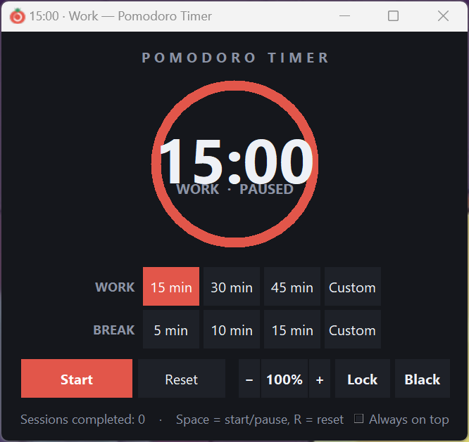
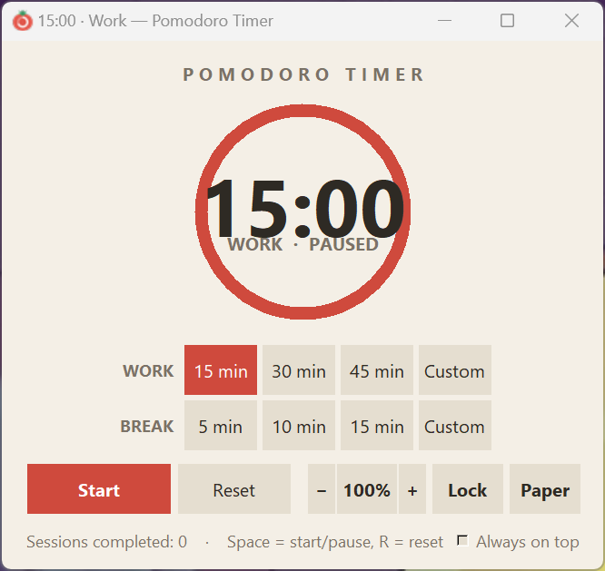
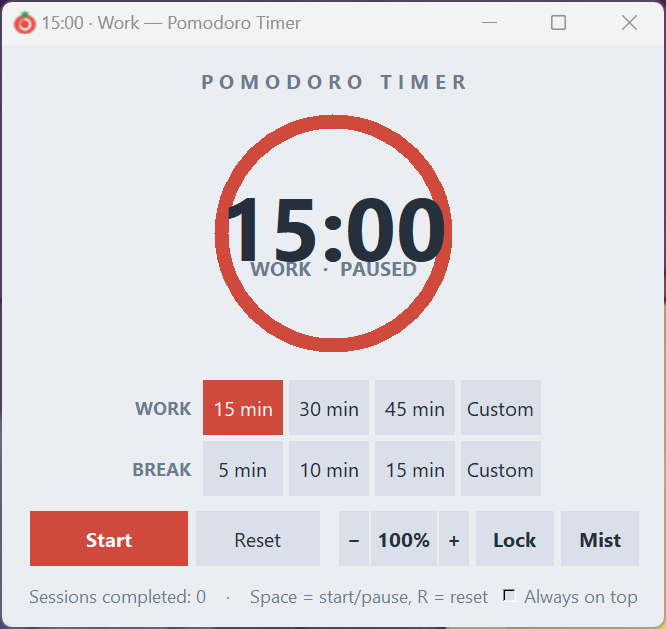
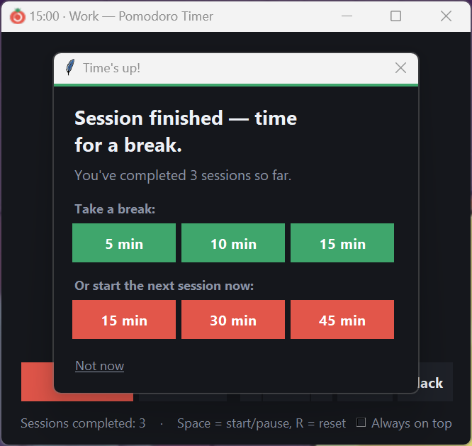

# Pomodoro Timer

A Pomodoro focus timer for Windows that works **entirely offline**. No installer,
no ads, no analytics, no accounts — a single `.exe` you double-click, which writes
nothing to your machine but a small settings file remembering your theme and
window size.

[**⬇ Download for Windows**](https://github.com/Micheal-Jiaming/pomodoro-timer/releases/latest/download/PomodoroTimer.exe)
· Requires 64-bit Windows · [Apache-2.0](LICENSE)

<table>
  <tr>
    <td align="center"><br><sub><b>Black</b></sub></td>
    <td align="center"><br><sub><b>Paper</b></sub></td>
  </tr>
  <tr>
    <td align="center"><br><sub><b>Mist</b></sub></td>
    <td align="center"><br><sub><b>End of a session</b></sub></td>
  </tr>
</table>

## What it does

The Pomodoro method is simple: work in a fixed block of time, then take a real
break, and repeat. This app is built around that loop rather than around a bare
countdown.

**Pick a length and start it.** The **WORK** row offers 15, 30 and 45 minutes;
the **BREAK** row offers 5, 10 and 15. **Custom** takes anything from 1 to 180
minutes. Click a preset to arm it, then **Start** — or just press `Space`.

**Watch it deplete.** The ring empties as the time runs down, with the remaining
minutes in the middle and the mode underneath. Work is red, break is green, and
the whole window follows the mode, so a glance tells you which one you are in.
The countdown is repeated in the title bar, so you can read it straight from the
taskbar without switching windows.

**It tells you when the time is up.** The app beeps, raises itself in front of
whatever you were doing, and opens the prompt in the fourth screenshot above.
That prompt is the point of the whole app: it offers the three break lengths and
the three work lengths side by side, so continuing the cycle is one click rather
than a decision. Choosing one starts it immediately.

**The countdown cannot drift.** It is anchored to a finishing time rather than
counting ticks and adding them up, so a session that says 45 minutes takes 45
minutes, no matter how busy the machine gets in between.

### Everything else

- **Three themes** — Black for dark desktops, Paper (warm cream) and Mist (cool
  grey) for bright rooms. Each is a whole palette, not just a background, and
  switching changes nothing but colour: the window keeps its exact size.
- **Resize it to suit you** — zoom the entire interface, not just the text, from
  a compact corner widget up to something readable across the room. `Ctrl`+`L`
  locks the proportions so dragging an edge cannot distort it.
- **Always on top** — an optional tick box to keep it above other windows.
- **A completed-session counter**, so you can see how the day went.
- **Your theme and window size are remembered** between runs.

## Keyboard shortcuts

| Key | Action |
| --- | --- |
| `Space` | Start / pause |
| `R` | Reset the current session |
| `1` `2` `3` | Work presets — 15 / 30 / 45 minutes |
| `4` `5` `6` | Break presets — 5 / 10 / 15 minutes |
| `Ctrl` `+` / `Ctrl` `-` | Zoom in / out — `Ctrl` + mouse wheel also works |
| `Ctrl` `0` | Back to 100% |
| `Ctrl` `L` | Lock the window size |
| `Ctrl` `T` | Next theme |

## Installing

There is nothing to install. Download
[`PomodoroTimer.exe`](https://github.com/Micheal-Jiaming/pomodoro-timer/releases/latest/download/PomodoroTimer.exe)
and double-click it. Python, Tkinter and the icon are all bundled inside the one
file, so it runs from anywhere — your Desktop, a USB stick, a network share —
on a machine with no Python on it.

> **Two warnings you should expect, neither of which means anything is wrong.**
> Your browser may say the file *"isn't commonly downloaded"* — that is what
> browsers say about any executable few people have fetched yet. Then Windows
> SmartScreen shows *"Windows protected your PC"*; choose **More info → Run
> anyway**. Both appear because the build is not signed with a paid code-signing
> certificate, and neither zipping the file nor rehosting it changes that.

The only thing the app leaves behind is `%APPDATA%\PomodoroTimer\settings.json`,
holding your theme and window size. Delete the `.exe` and that file and nothing
of it remains.

## Building from source

The source is one file and needs no third-party packages — Python 3 and its
bundled Tkinter are enough:

```
py pomodoro_timer.py
```

To produce the standalone `.exe` yourself, install PyInstaller
(`py -m pip install pyinstaller`) and run:

```powershell
powershell -ExecutionPolicy Bypass -File build_exe.ps1
```

The result appears in `dist\`. It is deliberately not tracked in Git — it is
reproducible from the source beside it, and released builds are attached to the
[Releases](https://github.com/Micheal-Jiaming/pomodoro-timer/releases) page instead.

## Documentation

[`pomodoro-timer.md`](pomodoro-timer.md) is the full project document —
architecture, the reasoning behind each feature, the publishing route, and an
honest account of what has and has not been verified. Start there rather than
here if you intend to work on the code.

## Android

There is a port for Android at
[Pomodoro-timer-Android](https://github.com/Micheal-Jiaming/Pomodoro-timer-Android)
— the same timer, the same three palettes, the same end-of-session prompts.

## Licence

[Apache License 2.0](LICENSE) — Copyright 2026 Micheal-Jiaming.
